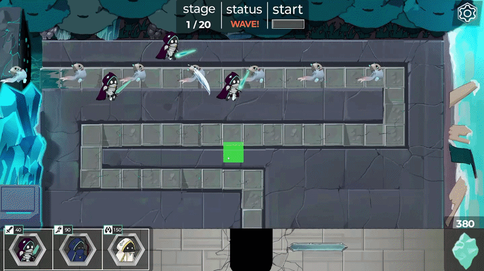
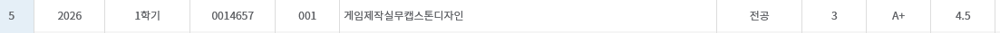

# Soul Collector

## 📌 게임 소개

- 프로젝트 개발 기간 : 2026.04 ~ 2026.06
- 장르 : 2D 타워 디펜스 게임
- 플랫폼 : PC
- 팀원 : 개발 2명, 그래픽 2명, 기획 1명
- 비고 : 해당 프로젝트에서 **메인 게임 프로그래머** 입니다.

## 📖 게임 설명

**< 몰려오는 적들로부터 크리스탈을 지켜내자! >**

Soul Collector은 소환수를 소환하여 악의 근원에 물든 악마들을 처치하고 영혼을 회수하는 게임입니다. <br>
플레이어는 총 3종류의 소환수를 소환할 수 있으며, 악마들이 크리스탈로 이어진 통로를 통과하기 전에 소환수를 적절한 위치에 설치하여 막아내야 합니다.



## 🎬 플레이 영상

- &nbsp; [](https://youtu.be/SbnAHzEwJqo?si=iudo3Bq4X8eC2RR-)

## 📄 담당 업무

### 시스템
- 소환수 설치
  - 소환수 설치 위치 가이드 기능
  - 소환수 설치 위치를 격자로 보정하는 기능
  - 소환수가 설치될 수 없는 위치는 return하는 기능
  - 소환수가 중복 설치되지 않는 기능
  - 소환수가 설치될 때 cost가 감소하는 기능
- 일시 정지 기능 (ESC 키)
  - 소리 설정
  - 설정 값 저장 기능
  - 해상도 변경 기능
- 타이틀 화면

### 소환수
- 공통
  - 범위 내 적 발견 시 공격
  - 가장 먼저 들어온 적을 우선 순위로 공격
  - 공격하던 적이 범위 밖으로 나가거나, 처치되면 그 다음으로 들어온 적을 타겟으로 공격
  - 소환수들의 공격 쿨타임
  - 소환수들의 공격
  - 각 소환수들의 공격 메커니즘
  - 각 소환수들의 애니메이션
  - 각 소환수들이 공격하는 탄막 또는 이펙트의 애니메이션
  - 각 소환수가 공격을 시도하는 중에 적이 범위 내에 존재하지 않으면 취소하는 기능
  - 각 소환수가 공격을 시도하는 중에 타겟이 사라지고, 범위 내에 다른 타겟이 발견되면 해당 타겟을 공격하는 기능
- 영혼 기사
  - 범위 내의 적을 즉시 공격하는 기능
- 암흑 주술사
  - 범위 내의 적 발견 시 해당 적을 추적하는 탄을 발사하는 기능
- 사제
  - 범위 내의 적 발견 시 해당 적이 있는 방향으로 강력한 레이저를 발사하는 기능
  - 레이저가 여러 명의 적을 동시에 타격할 수 있는 기능

### 연출
- 전체적인 사운드 관련 기능
- 게임을 클리어하거나, 실패했을 때 나타나는 연출
- 씬이 전환될 때 페이드 연출되는 기능
- 카메라 연출
- 악마를 놓쳐서 균열로 들어갔을 때 피격되는 연출
- 맵 내 크리스탈이 있는 부분 / 바다 쪽에 태양빛이 반사되는 Light 연출
- 소환수가 설치될 때 파티클이 발생하는 연출

### 기타
- 맵 배치
- 맵 오브젝트 배치
- 연출 부분에 적혀있지 않은 모든 폴리싱 작업
- 팀 내에 다른 개발자가 만든 기능들과 호환되게 합치는 기능
- 그래픽 디자이너와 기획자, 개발자들과의 소통 및 조율

## 🎖️ 결과

🎮 2026 1학기 교내 캡스톤 과목에서 가장 우수한 팀
- 교내 캡스톤 과목에서 각 팀들 중 가장 높은 점수를 받고 A+ 등급을 받음.



<br>

 ---
 
<br>

## 💡 프로젝트를 통해 얻은 경험
- **<U>Git</U>**
- **<U>Interface</U>**
- **<U>SOLID</U>**
- **<U>IDE AI Agent 활용 경험</U>**
- **<U>Object Pool</U>**
- 상속
- New Input System

## 🔋 개발 동기

2026년 대학교 수강 과목 중 하나인 "게임 제작 실무 캡스톤 디자인"에서 구성해준 팀원으로 게임을 개발하게 되었습니다. 작년에 협업한 경험도 있었고, 그때와 지금의 텀 동안 알게 된 다양한 기술과 구조 설계를 본격적으로 적용해볼 기회라고 생각했습니다. 이전에 개발한 [Barrel good Barrel](https://github.com/Byeo1ha/Barrel-good-Barrel)은 기획서 없이 개발 되었고, 그래픽 디자이너 또한 없어서 한계가 명확했습니다. 하지만 이번 팀은 앞서 언급된 문제가 없어서 더욱 진심으로 임하게 되었던 것 같습니다.

## ❓ 문제 해결 및 개선

### Q1. 소환수 유지보수

기획자가 보내준 기획 문서를 읽어보고 그대로 기능을 구현하면서 이상한 점을 느꼈습니다.

> 복사 붙여넣기를 너무 많이 했는데?

실제로 소환수를 구현하면서 겹치는 기능이 무척 많았기 때문입니다. 위에서 언급한 '담당 업무' 부분을 보시면 알 수 있겠지만 모든 소환수는

```
- 적을 타겟하는 메커니즘
- 공격하기 전에 거쳐야하는 선 딜레이
- 공격 애니메이션
- 공격 쿨타임
- 공격 중 발생하는 변수
```

이러한 상황에 대한 코드들이 비슷했습니다. 이를 생각 없이 복사 붙여넣기를 한다면 소환수의 메커니즘이 변경되었을 때, 모든 소환수를 하나 하나 찾아 코드를 수정해야하고, 소환수가 만약 새로 추가된다면, 기존 소환수 코드를 또 복사하고 붙여넣기 해야했습니다. 즉 유지보수면에서 조금 고민을 하게 되었습니다.


### A1. 해결 방법

방학동안 공부했던 **상속**이란 개념을 사용해보았습니다. 각 터렛은 [TurretBase.cs](https://github.com/Byeo1ha/SoulCollector/blob/main/Assets/Scripts/Turret/TurretBase.cs)를 상속 받습니다. TurretBase.cs에는 위에 언급한 기능들이 구현되어있거나, `abstract` 키워드로 자식 클래스가 구현할 것을 약속합니다.
 
 그 후 각 자식 클래스들이 `override` 키워드를 사용하여 `TryAttack`등의 함수를 구현해서 사용하는 형식으로 구현했습니다. 이로써 새로운 소환수가 추가되어도 `TurretBase`를 상속받으면 되고, 공통 로직은 `TurretBase`에서 한번에 수정할 수 있도록 개선했습니다.
  
<br>

### Q2. 애니메이션 재생
프로젝트를 개발할 때 처음에 기획자는 이렇게 말했습니다.

> 근접 공격을 하는 영혼 기사, 탄막을 발사하는 암흑 주술사, 관통형 레이저를 발사하는 영혼 사제 이렇게 3가지만 구현할 것이다. 이 외에 다른 소환수는 추가하지 않을 것이다.

사실 기말고사까지 개발할 작은 규모의 게임이니 이러한 전략은 충분히 납득이 되었습니다. 하지만 저는 이 말을 듣고 다른 것을 고민했습니다.
 
 > 확장성
  
조금 어렵게 돌아가보기로 했습니다.

> 만약 이 게임이 계속 개발된다면? 그럼 확장성과 유지보수를 고려해야하지 않을까?

그래서 저는 위에서 언급한 상속 기능을 사용할 때

```
SoulKnight.cs > 영혼 기사
DarkSorcerer.cs > 암흑 주술사
SoulPriest.cs > 영혼 사제
```

이렇게 구분해서 `TurretBase`를 상속받는 구조가 아닙니다. 새로 추가될 소환수가 암흑 주술사처럼 탄막을 발사할 수도 있고, 영혼 사제처럼 레이저를 발사할 수도 있고, 영혼 기사처럼 근접 공격을 할 수도 있지 않습니까? 그래서 저는 다음과 같이 만들었습니다.

```
TurretArea.cs > 영역 공격
TurretProjectile.cs > 탄막 공격
TurretLaser.cs > 레이저 공격
```

이렇게 되면 새로 추가될 소환수가 새로운 유형이 아닌 이상 재사용할 수 있게 될 것입니다. 여기까지는 순조로웠습니다. 하지만 문제는 애니메이션을 재생할 때 였습니다. 예를 들어 레이저 공격을 하는 영혼 사제의 애니메이션을 재생한다고 가정해봅시다. 영혼 사제의 공격 메커니즘은 `TurretLaser`이 가지고 있습니다. 공격과 동시에 영혼 사제의 공격 애니메이션을 재생시켜야하는데, 문제는 이 TurretLaser은 자신이 영혼 사제인지 아니면 다른 소환수인지 알 방법이 없습니다.
 
### A2. 해결 방법

그래서 사용한 것이 바로 인터페이스(Interface)였습니다.<br>
[ITurretAttackAnim.cs](https://github.com/Byeo1ha/SoulCollector/blob/main/Assets/Scripts/Turret/Animation/ITurretAttackAnim.cs)에서 애니메이션 재생 인터페이스를 만듭니다. [SoulPriestAnim.cs](https://github.com/Byeo1ha/SoulCollector/blob/main/Assets/Scripts/Turret/Animation/SoulPriestAnim.cs)이 `ITurretAttackAnim`을 구현하게 한 뒤, `TurretLaser`에서 애니메이션을 재생할 때 직접 객체의 애니메이션을 조작하는 게 아닌, `ITurretAttackAnim` 인터페이스에게 요청하는 것입니다.

`TurretLaser`는 받아둔 `ITurretAttackAnim` 컴포넌트에게 애니메이션 실행을 요청하고, `ITurretAttackAnim`에 속한 `SoulPriestAnim`이 애니메이션을 실행하는 구조가 되었습니다.

<br>

### Q3. Git Merge

우선 이번 프로젝트에서 가장 큰 경험은 **Git**이었습니다. 이것으로 Branch를 나눠서 작업을 분리하는 과정이나, 발생한 문제를 롤백하는 기능을 쓰거나, 노트북으로 개발을 이어가야할 때 따로 클라우드에 업로드할 필요없이 Git으로 관리하던 경험도 좋았던 것 같습니다.

하지만 팀내 다른 개발자가 만든 기능과 Merge 할 때 발생하던 문제는 지금 생각해도 끔찍했습니다. Merge 도중 발생한 문제가 코드면 서로 상의하며 해결할 수 있지만, 애니메이션 로직이 꼬이는 경우나 코드 이외 부분에서 말썽을 피우는게 가장 난처했습니다. 그리고 이 일은 제가 이 프로젝트를 개발하면서 조우했던 문제였습니다.
 
### A3. 해결 방법

제 작업 환경 IDE는 VS Code입니다. 확장 프로그램으로 codex가 설치되어있고, 이 codex 에이전트에게 Commit 기록과 함께 상황을 설명하고 부탁하여 Merge로 인해 발생하여 깨진 파일들을 무사히 복구해내는데 성공했습니다.
 
저는 개발 당시에 IDE의 AI를 사용하는 것을 굉장히 꺼려했습니다. 개발 시간 단축과 편리함은 부정할 수 없지만, 저 스스로가 그것을 통제할 그릇이라고 생각하지 않았기 때문입니다. AI에게 코드를 맡긴 순간 그것은 제 것이 아니라는 생각을 가졌었습니다. 그래서 만약 사용해도, 의견을 제시하는 정도나 생소한 키워드 사용에 대한 질문, 구조 설계에 대한 고민 정도만 나누는 정도였습니다. 하지만 코드 밖 영역에서도 이렇게 AI가 큰 도움을 주었다는 것에 새롭게 보게 되었습니다. AI는 코드를 짜주는 도구이기 전에, 프로젝트에 발생한 코드 영역 이외의 문제를 해결해주는 용도로도 사용할 수 있다는 것을 말입니다.

## ✍️ 개발하면서 느낀 점

방학동안 성장했었고, 새로운 배운 구조 설계 방법을 사용하고 실습하는 또 하나의 경험이 되었습니다.
 
특히 Interface가 가장 인상 깊었습니다. Interface가 없어도 구현하는데 문제는 없지만, 확장성을 고려하면 이 Interface의 존재를 무시하기 힘들다는 것을 이번 프로젝트에서 깨닫게 되었습니다.

또한 이 프로젝트에선 처음으로 AI를 저의 어시스트로 사용하여 개발했습니다. AI에게 직접 코드 수정을 맡기기도 했지만, 그런 쪽보단 전체적인 프로젝트 설계를 검토하거나, 구조 설계의 조언을 받는 부분에서 더 많이 사용했습니다.

Git 또한 저에게 새로운 무대를 열어주는 열쇠 중 하나였습니다. 이전에 개발했던 협업 프로젝트는 unitypackage로 하나 하나 받았다면, 이제는 더 효율적으로 프로젝트를 관리하고 협업을 진행할 수 있게 되었습니다.

그리고 제 프로젝트들 중 처음으로 SOLID 원칙을 의식하여 구조를 설계한 프로젝트입니다. 처음 적용해보는 만큼 책임 분리를 신중하게 했으며 특히 소환수를 설치하는 부분에서는

```
TurretBuildBtn.cs > 소환수 설치 버튼 관련 기능
TurretBuildController.cs > 다른 클래스들을 불러와 소환수 설치를 관리하는 감독 클래스
TurretBuildGuide.cs > 소환수가 어디에 설치되는지 미리 보여주는 클래스
TurretPool.cs > 소환수 오브젝트 풀링
TurretValidator.cs > 소환수가 설치 될 수 있는 위치인지 없는지 검사하는 클래스
GridSnapper.cs > 소환수가 격자 좌표에 설치될 수 있게 보정해주는 클래스
```

등으로 책임을 분리해두었습니다.<br>
물론 이렇게 다 만들고 다시 읽어보면 아쉬운 점도 발견할 수 있었습니다. [TurretBuildController.cs](https://github.com/Byeo1ha/SoulCollector/blob/main/Assets/Scripts/Build/TurretBuildController.cs)가 눈에 보이지 않는 책임을 조금 가지고 있습니다. 규모가 작아서 문제 되지 않고, 지금도 충분히 제 판단엔 좋은 구조이지만, 아무래도 당시에 옵저버 패턴이 익숙하지 않았다보니, 이러한 구조가 나온 것 같습니다. 지금의 저였다면 각 컴포넌트를 `TurretBuildController`에 알려주기 보다는, `TurretBuildController`에서 `event Action`을 하나 만들고, 필요한 클래스들이 그 이벤트를 구독해서 실행하는 방식으로 했다면 어떨까 싶습니다. 물론 옵저버 패턴이 항상 정답은 아니고, 이런 작은 규모의 구조에선 지금 구조도 충분히 정답이 맞다고 생각합니다. 
 
결정적으로 이 프로젝트는 Barrel good Barrel과 Hungry Foxy 2와 비교를 하면 엄청난 발전을 이루었다고 생각하고 만족스러운 프로젝트 중 하나였다고 생각합니다.

<br>

 ---
 
<br>

 ## 📚 사용 에셋

- 없음

## 🎵 사운드

- Google Gemini를 통해 생성된 AI 배경 음악 및 효과음
